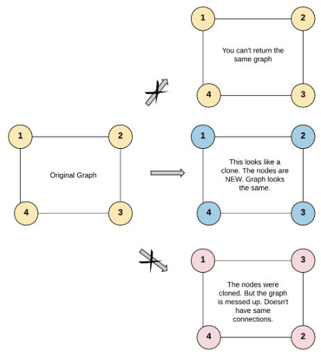
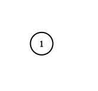

## [Clone Graph](https://leetcode.com/problems/clone-graph/)
Given a reference of a node in a connected undirected graph.

Return a deep copy (clone) of the graph.

Each node in the graph contains a value (int) and a list (List[Node]) of its neighbors.

class Node {
    public int val;
    public List<Node> neighbors;
}
 

Test case format:

For simplicity, each node's value is the same as the node's index (1-indexed). For example, the first node with val == 1, the second node with val == 2, and so on. The graph is represented in the test case using an adjacency list.

An adjacency list is a collection of unordered lists used to represent a finite graph. Each list describes the set of neighbors of a node in the graph.

The given node will always be the first node with val = 1. You must return the copy of the given node as a reference to the cloned graph.

 

Example 1:


Input: adjList = [[2,4],[1,3],[2,4],[1,3]]
Output: [[2,4],[1,3],[2,4],[1,3]]
Explanation: There are 4 nodes in the graph.
1st node (val = 1)'s neighbors are 2nd node (val = 2) and 4th node (val = 4).
2nd node (val = 2)'s neighbors are 1st node (val = 1) and 3rd node (val = 3).
3rd node (val = 3)'s neighbors are 2nd node (val = 2) and 4th node (val = 4).
4th node (val = 4)'s neighbors are 1st node (val = 1) and 3rd node (val = 3).

Example 2:


Input: adjList = [[]]
Output: [[]]
Explanation: Note that the input contains one empty list. The graph consists of only one node with val = 1 and it does not have any neighbors.
Example 3:

Input: adjList = []
Output: []
Explanation: This an empty graph, it does not have any nodes.
 

Constraints:

The number of nodes in the graph is in the range [0, 100].
1 <= Node.val <= 100
Node.val is unique for each node.
There are no repeated edges and no self-loops in the graph.
The Graph is connected and all nodes can be visited starting from the given node.

## 생각한 방법
1. 재귀쓰면 1000번정도 함수호출을 하는 것 같아 스택오버플로우가 날 줄 알았는데, 알고보니 1000번은 문제없었다.
2. 그래서 DFS사용함
3. queue와 쓸데없는 주소값을 담은 변수들을 선언한것 같아 다른분들의 답을 봄.
4. Node* -> Node* 오리지날로 카피본을 만들면 map에 담아 visited처리를 한 걸 봤는데 좋은듯함.


## 내 답안

```c++
/*
// Definition for a Node.
class Node {
public:
    int val;
    vector<Node*> neighbors;
    Node() {
        val = 0;
        neighbors = vector<Node*>();
    }
    Node(int _val) {
        val = _val;
        neighbors = vector<Node*>();
    }
    Node(int _val, vector<Node*> _neighbors) {
        val = _val;
        neighbors = _neighbors;
    }
};
*/

class Solution {
public:
    unordered_map<Node*,Node*> hm; //각 노드 저장
    Node* dfs(Node* node){
        if(node == NULL){
            return NULL;
        }

        if(hm.find(node)!=hm.end()){
            return hm[node];
        }

        hm[node] = new Node(node->val);
        
        for(Node* child : node->neighbors){
            hm[node]->neighbors.push_back(dfs(child));
        }

        return hm[node];
    }


    Node* cloneGraph(Node* node) {
        return dfs(node);
    }
};
```

## 답안
```c++
class Solution {
    unordered_map<Node*,Node*> s;
public:
    Node* cloneGraph(Node* node) {
        return solve(node);
    }
    Node* solve(Node* node){
        if(node==NULL) return NULL;
        if(s.find(node)!=s.end()) return s[node];
        Node* newNode = new Node(node->val);
        s[node]=newNode;
        for(auto x : node->neighbors){
            newNode->neighbors.push_back(solve(x));
        }
        return newNode;
    }
};
```