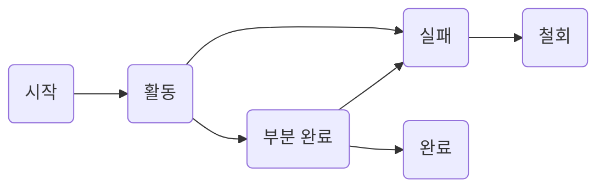

- [CRUD](#CRUD)
- [트랜잭션](#트랜잭션)
- [인덱스](#인덱스)
- [뷰](#뷰)
- [파티션](#파티션)
- [분산 데이터베이스](#분산-데이터베이스)
- [암호화](#암호화)
- [접근통제](#접근통제)
- [DAS](#DAS)
- [SAN](#SAN)

# CRUD
Create, Read, Update, Delete의 약어

# 트랜잭션
DB 상태를 변환시키는 하나의 논리적 기능을 수행하기 위한 작업의 단위 or 한꺼번에 모두 수행되어야 할 일련의 연산

## 트랜잭션 상태

1. 활동 : 트랜잭션이 실행중
2. 실패 : 트랜잭션 실행에 오류가 발생하여 중단된 상태
3. 철회(Abort) : 트랜잭션이 비정상적으로 종료되어 Rollback연산을 수행한 상태
4. 부분 완료(Partially Committed) : 트랜잭션을 모두 성공적으로 실행한 후 Commit 연산이 실행되기 직전 상태
5. 완료(Committed) : 트랜잭션을 모두 성공적으로 실행한 후 Commit 연산을 실행한 후 상태

## 트랜잭션 특성(ACID)
데이터의 무결성(Integrity)을 보장하기 위해 사용.
- - **Atomicity(원자성)** : 모두 반영되어 완료(Committed)되거나, 전혀 반영되지 않도록 복구(RollBack)되어야 한다.
- - **Consistency(일관성)** : 트랜잭션이 그 실행을 성공적으로 완료하면 언제나 일관성 있는 DB 상태로 변환. 트랜잭션 수행 전과 후의 시스템이 가지고 있는 고정 요소는 변함없어야 함.
  - **Isolation(독립성)** : 둘 이상의 트랜잭션이 실행되는 경우, 어느 하나의 트랜잭션 실행중에 다른 트랜잭션의 연산이 끼어들 수 없다.
  - **Durability(영속성)** : 성공적으로 완료된 트랜잭션의 결과는 시스템이 고장나더라도 영구적으로 반영되어야 한다.

# 인덱스
데이터 레코드에 빠르게 접근하기 위해 <키값, 포인터> 쌍으로 구성된 데이터 구조

**클러스티드 인덱스(Clustered Index)**
인덱스 키의 순서에 따라 데이터가 저장되는 방식  
실제 데이터가 순서대로 저장되어 있는 경우

**넌클러스티드 인덱스(Non-Clustered Index)**
인덱스 키값만 정렬되어 있을 뿐, 실제 데이터는 정렬되지 않는 방식  
한개의 릴레이션에 여러 개의 인덱스 생성 가능
인덱스를 검색하여 실제 데이터의 위치를 확인해야 함

## 트리 기반 인덱스

- B 트리 인덱스
- B+ 트리 인덱스

# 뷰

# 파티션

# 분산 데이터베이스

# 암호화

# 접근통제

# DAS

# SAN
