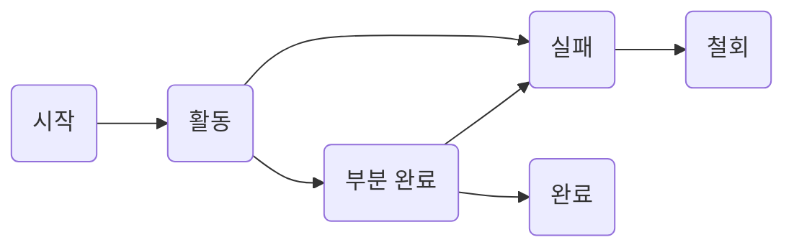

- [CRUD](#crud)
- [트랜잭션](#트랜잭션)
  - [트랜잭션 상태](#트랜잭션-상태)
  - [트랜잭션 특성(ACID)](#트랜잭션-특성acid)
- [인덱스](#인덱스)
  - [트리 기반 인덱스](#트리-기반-인덱스)
    - [B 트리 인덱스](#b-트리-인덱스)
    - [B+ 트리 인덱스](#b-트리-인덱스-1)
- [뷰](#뷰)
- [파티션](#파티션)
- [분산 데이터베이스](#분산-데이터베이스)
- [암호화](#암호화)
- [접근통제](#접근통제)
- [DAS(Direct Attached Storage)](#dasdirect-attached-storage)
- [SAN(Storage Area Network)](#sanstorage-area-network)

# CRUD
Create, Read, Update, Delete의 약어

# 트랜잭션
DB 상태를 변환시키는 하나의 논리적 기능을 수행하기 위한 작업의 단위 or 한꺼번에 모두 수행되어야 할 일련의 연산

## 트랜잭션 상태

1. 활동 : 트랜잭션이 실행중
2. 실패 : 트랜잭션 실행에 오류가 발생하여 중단된 상태
3. 철회(Abort) : 트랜잭션이 비정상적으로 종료되어 Rollback연산을 수행한 상태
4. 부분 완료(Partially Committed) : 트랜잭션을 모두 성공적으로 실행한 후 Commit 연산이 실행되기 직전 상태
5. 완료(Committed) : 트랜잭션을 모두 성공적으로 실행한 후 Commit 연산을 실행한 후 상태

## 트랜잭션 특성(ACID)
데이터의 무결성(Integrity)을 보장하기 위해 사용.
- - **Atomicity(원자성)** : 모두 반영되어 완료(Committed)되거나, 전혀 반영되지 않도록 복구(RollBack)되어야 한다.
- - **Consistency(일관성)** : 트랜잭션이 그 실행을 성공적으로 완료하면 언제나 일관성 있는 DB 상태로 변환. 트랜잭션 수행 전과 후의 시스템이 가지고 있는 고정 요소는 변함없어야 함.
  - **Isolation(독립성)** : 둘 이상의 트랜잭션이 실행되는 경우, 어느 하나의 트랜잭션 실행중에 다른 트랜잭션의 연산이 끼어들 수 없다.
  - **Durability(영속성)** : 성공적으로 완료된 트랜잭션의 결과는 시스템이 고장나더라도 영구적으로 반영되어야 한다.

# 인덱스
데이터 레코드에 빠르게 접근하기 위해 <키값, 포인터> 쌍으로 구성된 데이터 구조

**클러스티드 인덱스(Clustered Index)**
인덱스 키의 순서에 따라 데이터가 저장되는 방식  
실제 데이터가 순서대로 저장되어 있는 경우

**넌클러스티드 인덱스(Non-Clustered Index)**
인덱스 키값만 정렬되어 있을 뿐, 실제 데이터는 정렬되지 않는 방식  
한개의 릴레이션에 여러 개의 인덱스 생성 가능
인덱스를 검색하여 실제 데이터의 위치를 확인해야 함

## 트리 기반 인덱스

### B 트리 인덱스

이진 트리를 확장해 하나의 노드가 가질 수 있는 자식 노드의 최대 숫자가 2보다 큰 트리 구조

### B+ 트리 인덱스

B+tree는 B-tree의 확장개념  
B-tree의 경우, internal 또는 branch 노드에 key와 data를 담을 수 있다. 하지만, B+tree의 경우 브랜치 노드에 key만 담아두고, data는 담지 않는다. 오직 리프 노드에만 key와 data를 저장하고, 리프 노드끼리 Linked list로 연결한다.
=> Range 검색 쉬움

# 뷰
사용자에게 접근이 허용된 자료만을 제한적으로 보여주기 위해 하나 이상이 기본 테이블로부터 유도된 가상 테이블.  

**[장점]**
- 물리적으로 존재하지 않지만, 사용자에겐 있는 것처럼 간주됨.  
- 뷰를 정의할 때는 CREATE, 제거할 때는 DROP문을 사용
- 데이터의 논리적 독립성을 제공
- 데이터 보안 용이
- 데이터 관리 용이
- 뷰 위에 또다른 뷰 정의 가능

**[단점]**
- 변경 불가
- 독립적인 인덱스를 가질 수 없음
- 뷰로 구성된 내용에 대해 삽입, 삭제, 갱신 연산에 제약이 따름

# 파티션
대용량의 테이블이나 인덱스를 작은 논리적 단위로 나눈 것

**범위 분할(Range Partitioning)**
지정한 열의 값을 기준으로 범위를 지정하여 분할

**해시 분할(Hash Partitioning)**
해시 함수를 적용한 결과값에 따라 데이터를 분할
- 데이터를 고르게 분산할 때 유용
- 데이터가 고른 컬럼에 효과적

**조합 분할(Composition Partitioning)**
범위 분할로 분할한 뒤, 해시 함수를 적용해 다시 분할

**목록 분할(List Partitioning)**
지정한 열 값에 대한 목록을 만들어 이를 기준으로 분할
ex. '국가' 열에 '한국, 미국, 일본'이 있는 경우 '미국'을 제외해 사용할 목적으로 '아시아'라는 목록을 만들어 분할

**라운드 로빈 분할(Round Robin Partitioning)**
레코드를 균일하게 분배하는 방식

# 분산 데이터베이스
논리적으로 하나의 시스템에 속하지만, 물리적으로는 네트워크를 통해 연결된 여러개의 컴퓨터에 분산되어 있는 데이터베이스

**구성 요소**
1. 분산 처리기 : 자체적으로 처리능력을 가지며 지리적으로 분산되어 있는 시스템
2. 분산 데이터베이스 : 지리적으로 분산되어 있는 데이터베이스로서 해당 지역의 특성에 맞게 데이터베이스가 구성
3. 통신 네트워크 : 분산처리기를 통신망으로 연결하여 논리적으로 하나의 시스템처럼 작동할 수 있도록 하는 통신 네트워크를 구성

**분산 데이터베이스의 목표**
1. 위치 투명성(Location Transparency) : 실제 위치를 알 필요없이 논리적 명칭만으로 액세스 가능
2. 중복 투명성(Replication Transparency) : 동일 데이터가 중복되더라도 사용자는 하나처럼 사용.
3. 병행 투명성(Concurrency Transparency) : 분산 DB와 관련된 다수의 트랜잭션들이 동시에 실현되더라도 그 트랜잭션의 결과는 영향을 받지 않음
4. 장애 투명성(Failure Transparency) : 에러가 나더라도 트랜잭션을 정확히 처리

# 암호화
데이터를 보낼 때 송신자가 지정한 수신자 이외에는 그 내용을 알 수 없도록 평문을 암호문으로 변환하는 것

**개인키 암호 방식**
동일한 키로 데이터를 암호화하고 복호화
ex.
전위 기법, 대체 기법, 대수 기법, 합성 기법(DES : 개인키 엄호 방식의 알고리즘, LUCIFER)

**공개키 암호 방식**
서로 다른 키로 데이터를 암호화하고 복호화
- 데이터를 암호화할 때 사용하는 키는 DB 사용자에게 공개
- 데이터를 복호화할 때 사용하는 키는 관리자가 비밀리에 관리
- 비대칭 암호 방식이라고도 하며, 대표적으로 RSA가 있음.

# 접근통제
데이터가 저장된 객체와 이를 사용하는 주체 사이의 정보흐름을 제한하는 것

**DAC(임의 접근 통제, Discretionary Access Control)**
- 데이터에 접근하는 사용자의 신원에 따라 접근 권한을 부여
- 데이터 소유자가 접근통제 권한을 지정하고 제어
- 변경 용이
- Identity

**MAC(강제 접근 통제, Mandatory Access Control)**
- 주체와 객체의 등급을 비교하여 접근 권한을 부여하는 방식
- 시스템이 접근통제 권한을 지정
- 변경 어려움
- Label
- 벨 라파듈라 모델(Bell LaPadula Model) : 군대처럼 보안 레벨에 따라 권한 제한

**RBAC(역할 기반 접근 통제, Role Based Access Control)**
- 사용자의 역할에 따라 접근 권한을 부여하는 방식
- 중앙관리자가 접근 통제 권한을 지정
- 변경 용이
- Role

# DAS(Direct Attached Storage)
서버와 저장장치를 전용케이블로 직접 연결하는 방식
- 서버와 스토리지가 직접 연결되어 있어 속도는 빠르나 다른 서버에서 스토리지에 접근해 사용 불가

# SAN(Storage Area Network)

NAS(Network Access Storage)와 DAS의 장점을 합친 방식.  
서버와 저장장치를 연결하는 전용 네트워크를 별도로 구성하는 방식
- 광 채널 스위치를 이용해 네트워크 구성