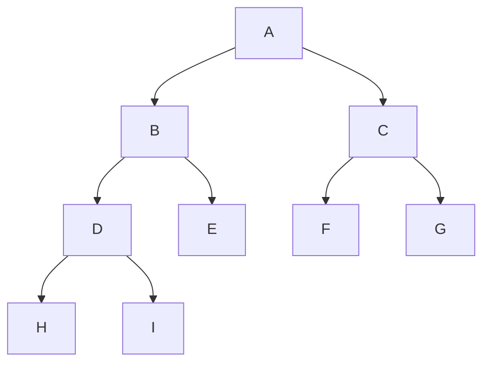
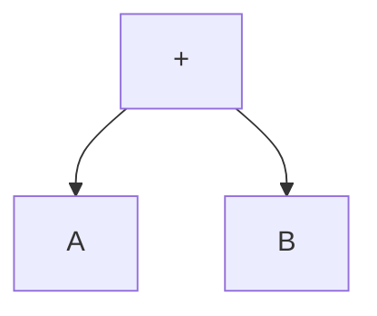

- [1. 자료 구조](#1-자료-구조)
  - [1.1 배열](#11-배열)
  - [1.2 선형 리스트](#12-선형-리스트)
    - [1.2.1 연속 리스트](#121-연속-리스트)
    - [1.2.2. 연결 리스트](#122-연결-리스트)
  - [1.3 스택](#13-스택)
  - [1.4 큐](#14-큐)
  - [1.5. 데크](#15-데크)
  - [1.6 그래프](#16-그래프)
- [2. 트리(tree)](#2-트리tree)
  - [2.1. 트리의 운행법(Traversal)](#21-트리의-운행법traversal)
  - [2.2. 수식의 표기법](#22-수식의-표기법)
- [3. 정렬(Sort)](#3-정렬sort)
  - [3.1 삽입정렬(Insertion Sort)](#31-삽입정렬insertion-sort)
  - [3.2 쉘 정렬(Shell Sort)](#32-쉘-정렬shell-sort)
  - [3.3 선택 정렬(Selection Sort)](#33-선택-정렬selection-sort)
  - [3.4 버블 정렬(Bubble Sort)](#34-버블-정렬bubble-sort)
  - [3.5 퀵 정렬(Quick Sort)](#35-퀵-정렬quick-sort)
  - [3.6. 힙 정렬(Heap Sort)](#36-힙-정렬heap-sort)
  - [3.7. 2 way 합병 정렬(Merge Sort)](#37-2-way-합병-정렬merge-sort)
  - [3.8 기수 정렬(Radix Sort, Bucket Sort)](#38-기수-정렬radix-sort-bucket-sort)
- [4. 검색 - 이분검색/해싱(Hashing)](#4-검색---이분검색해싱hashing)
- [5. 데이터베이스 개요](#5-데이터베이스-개요)
- [6. 절차형 SQL](#6-절차형-sql)


# 1. 자료 구조
- 선형 구조 : 배열, 선형리스트(연결리스트, 연속리스트), 스택, 큐, 데크(Deque)
- 비선형 구조 : 트리, 그래프

## 1.1 배열
동일 자료형의 데이터가 같은 크기로 나열되어 순서를 가지는 집합

- 첨자(index)를 이용해 데이터에 접근
- 반복적인 데이터 작업에 유리, 데이터마다 동일한 이름의 변수 사용.
- 사용한 첨자의 개수에 따라 n차원 배열이라 부름
- 접근 : O(1)
- 탐색, 삽입, 삭제 : O(n)

## 1.2 선형 리스트

일정한 순서에 의해 나열된 자료구조

### 1.2.1 연속 리스트
연속되는 메모리를 연결하는 리스트
- 메모리 이용 효율은 밀도가 1로 가장 좋음.
- 데이터 추가하거나 삭제하려면 해당 위치 이후의 모든 데이터를 이동시켜야 함.
- 접근 : O(1)
- 탐색, 삽입, 삭제 : O(n)

### 1.2.2. 연결 리스트
포인터로 접근하는 메모리를 연결하는 리스트
- 노드(데이터 부분, 링크 부분)로 이루어짐
- 삽입, 삭제 : O(1)
- 탐색, 접근 : O(n) 

## 1.3 스택
한쪽 끝으로만 삽입 삭제가 이루어지는 자료구조(LIFO)
- 함수 호출의 순서 제어, 인터럽트 처리, 수식 계산 및 수식표기법, 컴파일러를 이용한 언어번역, 부 프로그램 호출 시 복귀 주소 저장, 서브루틴 호출 및 복귀 주소 저장, 재귀호출, 후위 표현(Postfix Expression), 깊이 우선 탐색(DFS)
- 왔던 길을 되돌아가는 경우에 사용
- 스택의 모든 기억 공간이 꽉 차있을때 넣으면 오버플로우 발생, 빈 상태에서 데이터를 삭제하면 언더플로우 발생
  - 삭제하려면 제일 먼저 삭제할 자료가 있는지 확인해야함
```
[삽입(push)]
top = top + 1
if top > M
then
    Overflow
else
    x[top] <- item

M : 스택의 크기
x : 스택 이름

[삭제(pop)]
if top = 0
then
    Underflow
else
    item <- x[top]
    top = top - 1
```

## 1.4 큐
한쪽에서는 삽입, 다른 한쪽에서는 삭제 작업이 이루어지는 자료구조

- 프론트(F), 리어(R) 포인터를 사용
- 운영체제의 작업 스케줄링에 사용

## 1.5. 데크
삽입과 삭제가 양쪽 끝에서 모두 발생할 수 있는 자료구조
Double Ended Queue
- 입력은 한쪽에서만 일어나고 출력은 양쪽 다 가능한 입력 제한과, 입력은 양쪽에서 일어나고 출력은 한 곳에서만 이루어지는 출력 제한이 존재.
- 입력 제한 데크 : Scroll
- 출력 제한 데크 : Shelf  


## 1.6 그래프
정점(Vertex)과 간선(Edge)으로 이루어짐
- 간선의 방향성 유무에 따라 방향 그래프와 무방향 그래프로 나뉨
- 통신망(Network), 교통망, 이항관계, 연립방정식, 유기화학 구조식, 무향선분 해법 등에 응용
- 트리(Tree)는 사이클이 없는 그래프임
- 무방향 그래프에서 최대 간선 수 : v(v-1)/2
- 방향 그래프에서 최대 간선 수 : v(v-1)

# 2. 트리(tree)
정점(Node)과 선분(Branch)을 이용해 `사이클`을 이루지 않도록 구성한 그래프의 특수한 형태
- 가족의 계보, 족보, 조직도 등을 표현하기 적합
- Root Node : 트리의 맨 위에 있는 노드
- Degree(차수) : 각 노드에서 뻗어 나온 가지수
- Terminal Node(단말 노드)=잎 노드(Leaf Node) : 자식이 하나도 없는 노드, 디그리가 0인 노드
- 형제 노드(Sibling Node) : 동일한 부모를 갖는 노드들
- level 1,2,3,4 : 1이 root node
- 트리의 degree : 노드들의 degree중 가장 많은 수

```
e : 간선 총 수
n0 : 단말 노드 수
n1 : 차수 1인 노드 수
n2 : 차수 2인 노드 수
n : 노드 총 수
e = n1 + 2n2
- 차수 1인 노드수는 간선 수 1개, 차수 2인 노드수는 간선수 2개

n = e + 1
- 간선수가 곧 자식 노드수 + root 노드 1개

n = n0 + n1 + n2
- 차수 0,1,2짜리 노드들 전부 더하면 노드전체수


```

## 2.1. 트리의 운행법(Traversal)
이진트리의 운행법으로 Preorder, Inorder, Postorder가 존재.


- Preorder 운행법 :  Root -> Left -> Right
  - A -> B -> D -> H -> I -> E -> C -> F -> G : ABDHIECFG
- Inorder 운행법 : Left -> Root -> Right
  - H -> D -> I -> B -> E -> A -> F -> C -> G : HDIBEAFCG
- Postorder 운행법 : Left -> Right -> Root
  - H -> I -> D -> E -> B -> F -> G -> C -> A : HIDEBFGCA

## 2.2. 수식의 표기법
산술식을 계산하기 위해 기억 공간에 기억시키는 방법.

- **전위 표기법(Prefix)** : 연산자 -> Left -> Right : +AB
- **중위 표기법(Infix)** : Left -> 연산자 -> Right : A+B
- **후위 표기법(Postfix)** : Left -> Right -> 연산자 : AB+
- Postfix, Prefix는 스택을 이용하여 처리함
- Infix는 연산자의 우선순위에 따라 괄호로 묶는게 필요함

# 3. 정렬(Sort)

## 3.1 삽입정렬(Insertion Sort)
  
n번째 키를 1~n-1의 키와 비교하여 알맞은 순서에 삽입하여 정렬하는 방식  


2번째 키 - 1번째  
3번째 키 - 1,2번째  
4번째 키 - 1,2,3번째  
5번째 키 - 1,2,3,4번째  

- 시간복잡도 평균, 최악 둘다 O(n^2)

## 3.2 쉘 정렬(Shell Sort)
  
간격(gap)이란 매개변수를 받아서 부분 리스트를 만들고, 그 리스트를 삽입정렬로 정렬한 뒤 합쳐 정렬하는 방식.  
간격이 h라고 하면 h,h/2,h/2/2, ... 순으로 계속 부분 리스트를 생성해 처리. 

- 시간복잡도 평균 : O(n^1.5)
- 시간복잡도 최악 : O(n^2)

## 3.3 선택 정렬(Selection Sort)
n개의 레코드 중에서 최솟값을 찾아 첫번째 레코드 위치에 놓고, 나머지n-1개 중에서 다시 최소값을 찾아 두번째 레코드에 놓는 방식을 반복해 정렬.  

- 시간복잡도 평균, 최악 : O(n^2)

## 3.4 버블 정렬(Bubble Sort)
인접한 두개의 레코드들간 키값을 비교해 교환하는 정렬 방식  

- 계속 정렬 여부를 플래그 비트(f)로 결정
- 시간복잡도 평균, 최악 : O(n^2)

## 3.5 퀵 정렬(Quick Sort)
하나의 파일을 부분적으로 나눠서 키를 기준으로 작은것은 왼쪽, 큰것은 오른쪽에 분해시켜 정렬하는 방식.  
정렬 방식 중 가장 빠른 방식.
recursive하므로 스택 필요
분할 정복법
- 시간복잡도 평균 : O(nlogn)
- 시간복잡도 최악 : O(n^2)

## 3.6. 힙 정렬(Heap Sort)
전 이진 트리(Complete Binary Tree)를 이용한 정렬 방식
- 시간복잡도 평균, 최악 : O(nlogn)

## 3.7. 2 way 합병 정렬(Merge Sort)
이미 정렬된 두개의 파일을 한개의 파일로 합병하는 정렬 방식  

1. 두개의 키를 한 쌍으로 하여 각 쌍에 대해 순서를 정함
2. 순서대로 정렬된 각 쌍의 키들을 합병하여 하나의 정렬된 서브리스트로 만듦
3. 위 과정에서 정렬된 서브리스트를 하나의 정렬된 파일이 될 때까지 반복.

- 시간복잡도 평균, 최악 : O(nlogn)

## 3.8 기수 정렬(Radix Sort, Bucket Sort)
기수 정렬은 Queue를 이용해 자릿수 별로 정렬하는 방식.  
레코드의 키값을 분석하여 같은 수 또는 같은 문자까리 그 순서에 맞는 버킷에 분배하였다가 버킷의 순서대로 레코드를 꺼내어 정렬함.
- 시간복잡도 평균, 최악 : O(dn)


# 4. 검색 - 이분검색/해싱(Hashing)

# 5. 데이터베이스 개요

# 6. 절차형 SQL