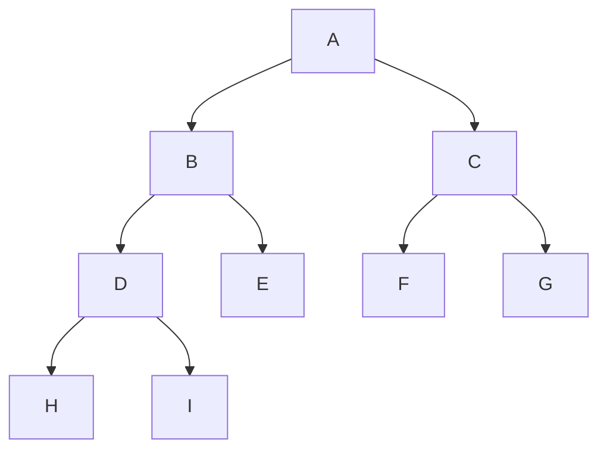
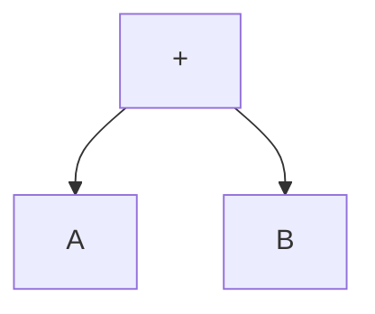

- [1. 자료 구조](#1-자료-구조)
  - [1.1 배열](#11-배열)
  - [1.2 선형 리스트](#12-선형-리스트)
    - [1.2.1 연속 리스트](#121-연속-리스트)
    - [1.2.2. 연결 리스트](#122-연결-리스트)
  - [1.3 스택](#13-스택)
  - [1.4 큐](#14-큐)
  - [1.5. 데크](#15-데크)
  - [1.6 그래프](#16-그래프)
- [2. 트리(tree)](#2-트리tree)
  - [2.1. 트리의 운행법(Traversal)](#21-트리의-운행법traversal)
  - [2.2. 수식의 표기법](#22-수식의-표기법)
- [3. 정렬(Sort)](#3-정렬sort)
  - [3.1 삽입정렬(Insertion Sort)](#31-삽입정렬insertion-sort)
  - [3.2 쉘 정렬(Shell Sort)](#32-쉘-정렬shell-sort)
  - [3.3 선택 정렬(Selection Sort)](#33-선택-정렬selection-sort)
  - [3.4 버블 정렬(Bubble Sort)](#34-버블-정렬bubble-sort)
  - [3.5 퀵 정렬(Quick Sort)](#35-퀵-정렬quick-sort)
  - [3.6. 힙 정렬(Heap Sort)](#36-힙-정렬heap-sort)
  - [3.7. 2 way 합병 정렬(Merge Sort)](#37-2-way-합병-정렬merge-sort)
  - [3.8 기수 정렬(Radix Sort, Bucket Sort)](#38-기수-정렬radix-sort-bucket-sort)
- [4. 검색 - 이분검색/해싱(Hashing)](#4-검색---이분검색해싱hashing)
  - [4.1. 이분검색](#41-이분검색)
  - [4.2. 해싱](#42-해싱)
    - [4.2.1. 해시 테이블(Hash Table)](#421-해시-테이블hash-table)
    - [4.2.2. 해싱 함수](#422-해싱-함수)
    - [4.2.3. 충돌 현상 해결 방법](#423-충돌-현상-해결-방법)
- [5. 데이터베이스 개요](#5-데이터베이스-개요)
  - [5.1. DBMS](#51-dbms)
    - [5.1.1. DDL(정의 기능)](#511-ddl정의-기능)
    - [5.1.2. DML(조작 기능)](#512-dml조작-기능)
    - [5.1.3. DCL(제어 기능)](#513-dcl제어-기능)
  - [5.2. DBMS의 장단점](#52-dbms의-장단점)
  - [5.3 스키마](#53-스키마)
- [6. 절차형 SQL](#6-절차형-sql)
  - [6.1 절차형 SQL의 테스트와 디버깅](#61-절차형-sql의-테스트와-디버깅)
  - [6.2 쿼리 성능 최적화](#62-쿼리-성능-최적화)


# 1. 자료 구조
- 선형 구조 : 배열, 선형리스트(연결리스트, 연속리스트), 스택, 큐, 데크(Deque)
- 비선형 구조 : 트리, 그래프

## 1.1 배열
동일 자료형의 데이터가 같은 크기로 나열되어 순서를 가지는 집합

- 첨자(index)를 이용해 데이터에 접근
- 반복적인 데이터 작업에 유리, 데이터마다 동일한 이름의 변수 사용.
- 사용한 첨자의 개수에 따라 n차원 배열이라 부름
- 접근 : O(1)
- 탐색, 삽입, 삭제 : O(n)

## 1.2 선형 리스트

일정한 순서에 의해 나열된 자료구조

### 1.2.1 연속 리스트
연속되는 메모리를 연결하는 리스트
- 메모리 이용 효율은 밀도가 1로 가장 좋음.
- 데이터 추가하거나 삭제하려면 해당 위치 이후의 모든 데이터를 이동시켜야 함.
- 접근 : O(1)
- 탐색, 삽입, 삭제 : O(n)

### 1.2.2. 연결 리스트
포인터로 접근하는 메모리를 연결하는 리스트
- 노드(데이터 부분, 링크 부분)로 이루어짐
- 삽입, 삭제 : O(1)
- 탐색, 접근 : O(n) 

## 1.3 스택
한쪽 끝으로만 삽입 삭제가 이루어지는 자료구조(LIFO)
- 함수 호출의 순서 제어, 인터럽트 처리, 수식 계산 및 수식표기법, 컴파일러를 이용한 언어번역, 부 프로그램 호출 시 복귀 주소 저장, 서브루틴 호출 및 복귀 주소 저장, 재귀호출, 후위 표현(Postfix Expression), 깊이 우선 탐색(DFS)
- 왔던 길을 되돌아가는 경우에 사용
- 스택의 모든 기억 공간이 꽉 차있을때 넣으면 오버플로우 발생, 빈 상태에서 데이터를 삭제하면 언더플로우 발생
  - 삭제하려면 제일 먼저 삭제할 자료가 있는지 확인해야함
```
[삽입(push)]
top = top + 1
if top > M
then
    Overflow
else
    x[top] <- item

M : 스택의 크기
x : 스택 이름

[삭제(pop)]
if top = 0
then
    Underflow
else
    item <- x[top]
    top = top - 1
```

## 1.4 큐
한쪽에서는 삽입, 다른 한쪽에서는 삭제 작업이 이루어지는 자료구조

- 프론트(F), 리어(R) 포인터를 사용
- 운영체제의 작업 스케줄링에 사용

## 1.5. 데크
삽입과 삭제가 양쪽 끝에서 모두 발생할 수 있는 자료구조
Double Ended Queue
- 입력은 한쪽에서만 일어나고 출력은 양쪽 다 가능한 입력 제한과, 입력은 양쪽에서 일어나고 출력은 한 곳에서만 이루어지는 출력 제한이 존재.
- 입력 제한 데크 : Scroll
- 출력 제한 데크 : Shelf  


## 1.6 그래프
정점(Vertex)과 간선(Edge)으로 이루어짐
- 간선의 방향성 유무에 따라 방향 그래프와 무방향 그래프로 나뉨
- 통신망(Network), 교통망, 이항관계, 연립방정식, 유기화학 구조식, 무향선분 해법 등에 응용
- 트리(Tree)는 사이클이 없는 그래프임
- 무방향 그래프에서 최대 간선 수 : v(v-1)/2
- 방향 그래프에서 최대 간선 수 : v(v-1)

# 2. 트리(tree)
정점(Node)과 선분(Branch)을 이용해 `사이클`을 이루지 않도록 구성한 그래프의 특수한 형태
- 가족의 계보, 족보, 조직도 등을 표현하기 적합
- Root Node : 트리의 맨 위에 있는 노드
- Degree(차수) : 각 노드에서 뻗어 나온 가지수
- Terminal Node(단말 노드)=잎 노드(Leaf Node) : 자식이 하나도 없는 노드, 디그리가 0인 노드
- 형제 노드(Sibling Node) : 동일한 부모를 갖는 노드들
- level 1,2,3,4 : 1이 root node
- 트리의 degree : 노드들의 degree중 가장 많은 수

```
e : 간선 총 수
n0 : 단말 노드 수
n1 : 차수 1인 노드 수
n2 : 차수 2인 노드 수
n : 노드 총 수
e = n1 + 2n2
- 차수 1인 노드수는 간선 수 1개, 차수 2인 노드수는 간선수 2개

n = e + 1
- 간선수가 곧 자식 노드수 + root 노드 1개

n = n0 + n1 + n2
- 차수 0,1,2짜리 노드들 전부 더하면 노드전체수


```

## 2.1. 트리의 운행법(Traversal)
이진트리의 운행법으로 Preorder, Inorder, Postorder가 존재.


- Preorder 운행법 :  Root -> Left -> Right
  - A -> B -> D -> H -> I -> E -> C -> F -> G : ABDHIECFG
- Inorder 운행법 : Left -> Root -> Right
  - H -> D -> I -> B -> E -> A -> F -> C -> G : HDIBEAFCG
- Postorder 운행법 : Left -> Right -> Root
  - H -> I -> D -> E -> B -> F -> G -> C -> A : HIDEBFGCA

## 2.2. 수식의 표기법
산술식을 계산하기 위해 기억 공간에 기억시키는 방법.

- **전위 표기법(Prefix)** : 연산자 -> Left -> Right : +AB
- **중위 표기법(Infix)** : Left -> 연산자 -> Right : A+B
- **후위 표기법(Postfix)** : Left -> Right -> 연산자 : AB+
- Postfix, Prefix는 스택을 이용하여 처리함
- Infix는 연산자의 우선순위에 따라 괄호로 묶는게 필요함

# 3. 정렬(Sort)

## 3.1 삽입정렬(Insertion Sort)
  
n번째 키를 1~n-1의 키와 비교하여 알맞은 순서에 삽입하여 정렬하는 방식  


2번째 키 - 1번째  
3번째 키 - 1,2번째  
4번째 키 - 1,2,3번째  
5번째 키 - 1,2,3,4번째  

- 시간복잡도 평균, 최악 둘다 O(n^2)

## 3.2 쉘 정렬(Shell Sort)
  
간격(gap)이란 매개변수를 받아서 부분 리스트를 만들고, 그 리스트를 삽입정렬로 정렬한 뒤 합쳐 정렬하는 방식.  
간격이 h라고 하면 h,h/2,h/2/2, ... 순으로 계속 부분 리스트를 생성해 처리. 

- 시간복잡도 평균 : O(n^1.5)
- 시간복잡도 최악 : O(n^2)

## 3.3 선택 정렬(Selection Sort)
n개의 레코드 중에서 최솟값을 찾아 첫번째 레코드 위치에 놓고, 나머지n-1개 중에서 다시 최소값을 찾아 두번째 레코드에 놓는 방식을 반복해 정렬.  

- 시간복잡도 평균, 최악 : O(n^2)

## 3.4 버블 정렬(Bubble Sort)
인접한 두개의 레코드들간 키값을 비교해 교환하는 정렬 방식  

- 계속 정렬 여부를 플래그 비트(f)로 결정
- 시간복잡도 평균, 최악 : O(n^2)

## 3.5 퀵 정렬(Quick Sort)
하나의 파일을 부분적으로 나눠서 키를 기준으로 작은것은 왼쪽, 큰것은 오른쪽에 분해시켜 정렬하는 방식.  
정렬 방식 중 가장 빠른 방식.
recursive하므로 스택 필요
분할 정복법
- 시간복잡도 평균 : O(nlogn)
- 시간복잡도 최악 : O(n^2)

## 3.6. 힙 정렬(Heap Sort)
전 이진 트리(Complete Binary Tree)를 이용한 정렬 방식
- 시간복잡도 평균, 최악 : O(nlogn)

## 3.7. 2 way 합병 정렬(Merge Sort)
이미 정렬된 두개의 파일을 한개의 파일로 합병하는 정렬 방식  

1. 두개의 키를 한 쌍으로 하여 각 쌍에 대해 순서를 정함
2. 순서대로 정렬된 각 쌍의 키들을 합병하여 하나의 정렬된 서브리스트로 만듦
3. 위 과정에서 정렬된 서브리스트를 하나의 정렬된 파일이 될 때까지 반복.

- 시간복잡도 평균, 최악 : O(nlogn)

## 3.8 기수 정렬(Radix Sort, Bucket Sort)
기수 정렬은 Queue를 이용해 자릿수 별로 정렬하는 방식.  
레코드의 키값을 분석하여 같은 수 또는 같은 문자까리 그 순서에 맞는 버킷에 분배하였다가 버킷의 순서대로 레코드를 꺼내어 정렬함.
- 시간복잡도 평균, 최악 : O(dn)


# 4. 검색 - 이분검색/해싱(Hashing)


## 4.1. 이분검색 

전체 파일을 두개의 서브파일로 분리해 가면서 Key 레코드를 검색하는 방식
- 반드시 순서화된 파일이어야 검색 가능
- 중간 레코드 번호 : (F+L)/2 => 정수만 취함   

ex. 1~100까지의 숫자 중 15를 찾는데 걸리는 횟수 : 5회
1. (1+100)/2 = 50 -> 50보다 낮으므로 1~49 사이  
2. (1+49)/2 = 25 -> 25보다 낮으므로 1~24 사이  
3. (1+24)/2 = 12.5 -> 12보다 크므로 13~24 사이  
4. (13+24)/2 = 18.5 -> 18보다 작으므로 13~17 사이
5. (13+17)/2 = 15 -> 찾음

## 4.2. 해싱

해싱은 해시 테이블이라는 기억 공간을 할당하고 해시 함수를 이용하여 레코드 키에 대한 해시 테이블 내의 홈 주소(Home Address)를 계산한 후 주어진 레코드를 해당 기억장소에 저장하거나 검색 작업을 수행하는 방식.  

### 4.2.1. 해시 테이블(Hash Table)
- **버킷** : 하나의 주소를 갖는 파일의 한 구역, 버킷의 크기는 같은 주소에 포함될 수 있는 레코드 수
- **슬롯(Slot)** : 한 개의 레코드를 저장할 수 있는 공간으로 n개의 슬롯이 모여 하나의 버킷을 형성
- **Collision** : 서로 다른 두개 이상의 레코드가 같은 주소를 갖는 현상
  - apple과 paypal이 해싱을 거쳤을 때 같은 주소를 가지면 `충돌`로 판단.
- **Synonym** : 충돌로 인해 같은 Home Address를 갖는 레코드의 집합
  - apple과 paypal이 해싱을 거쳤을 때 같은 주소를 가지면 {apple,paypal}이란 집합은 `동의어`로 판단.
- **Overflow** : 계산된 Home Address의 Bucket 내에 저장할 기억공간이 없는 상태, Bucket을 구성하는 Slot이 여러 개일 때 Collision은 발생해도 Overflow는 발생하지 않을 수 있다.

### 4.2.2. 해싱 함수
- **제산법(Division)** : 레코드 키(K)를 해시테이블의 크기보다 큰 수 중에서 가장 작은 소수(Prime,Q)로 나눈 나머지를 홈 주소로 삼는 방식
h(K) = K mod Q
- **제곱법(Mid-Square)** : 레코드 키(K)를 제곱한 후 중간 부분의 값을 홈 주소로 삼는 방법
- **폴딩법(Folding)** : 레코드 키 값을 여러 부분으로 나눈 후 각 부분의 값을 더하거나 XOR한 값을 홈 주소로 삼는 방식
- **기수 변환법(Radix)** : 키 숫자의 진수를 다른 진수로 변환시켜 주소 크기를 초과한 높은 자릿수는 절단하고, 이를 다시 주소 범위에 맞게 조정하는 방법.
- **대수적 코딩법(Algebraic Coding)** : 키 값을 이루고 있는 각 자리의 비트 수를 한 다항식의 계수로 간주하고, 이 다항식을 해시테이블의 크기에 의해 정의된 다항식으로 나누어 얻은 나머지 다항식의 계수를 홈 주소로 삼는 방식.
- **숫자 분석법(Digit Analysis)** : 키 값을 이루는 숫자의 분포를 분석하여 비교적 고른 자리를 필요한 만큼 택해서 홈 주소로 삼는 방식.
- **무작위법(Random)** : 난수를 발생시켜 나온 값을 홈 주소로 삼는 방식.

### 4.2.3. 충돌 현상 해결 방법
체이닝(Chaining) : 버킷에 할당된 연결 리스트에 데이터를 저장하는 방법
개방 주소법(Open Address) : 순차적으로 그 다음 빈 버킷을 찾아 데이터를 저장
재해싱(Rehashing) : 해싱 함수로 새로운 홈 주소를 구하는 방법

# 5. 데이터베이스 개요

데이터를 논리적인 구조로 조직화하거나 물리적인 공간에 구축한 것.
- 논리 데이터 저장소와 물리 데이터 저장소로 구분됨.
- `공동`으로 사용될 데이터를 중복을 배제하여 `통합`하고 쉽게 접근하여 처리할 수 있도록 저장장치에 `저장`하여 항상 사용할 수 있도록 운영하는 `운영` 데이터

- **통합된 데이터** : 자료의 중복을 배제한 데이터의 모임
- **저장된 데이터** : 컴퓨터가 접근할 수 있는 저장매체에 저장된 자료
- **운영 데이터** : 조직의 고유한 업무를 수행하는 데 존재 가치가 확실하고 없어서는 안될 반드시 필요한 자료
- **공용 데이터** : 여러 응용 시스템들이 공동으로 소유하고 유지하는 자료

## 5.1. DBMS
사용자와 DB 사이에서 사용자의 요구에 따라 정보를 생성해주고 DB를 관리해주는 소프트웨어.

- DBMS는 기존 파일이 갖는 데이터의 `종속성`과 `중복성`의 문제를 해결.
- DB의 구성, 접근방법, 유지관리에 대한 모든 책임을 짐.
- DBMS의 필수 기능으로는 정의(Definition), 조작(Manipulation), 제어(Control) 기능이 있음.

### 5.1.1. DDL(정의 기능)
모든 응용 프로그램이 요구하는 데이터 구조를 지원하기 위해 데이터베이스에 저장될 데이터의 형(Type)과 구조에 대한 정의, 이용 방식, 제약 조건 등을 명시하는 기능

### 5.1.2. DML(조작 기능)
데이터 검색, 갱신, 삽입, 삭제 등을 체계적으로 처리하기 위해 사용자와 DB사이의 인터페이스 수단을 제공하는 기능

### 5.1.3. DCL(제어 기능)
데이터베이스를 접근하는 갱신, 삽입, 삭제 작업이 정확하게 수행되어 데이터의 `무결성`이 유지되도록 제어.  
`보안성`과 `권한`을 검사할 수 있어야 함.   
DB에 접근할 때 정확성을 유지하기 위해 `병행 제어(Concurrency Control)`를 함.

## 5.2. DBMS의 장단점
<장점>
1. 논리적 물리적 독립성이 보장
2. 중복 피함 -> 기억 공간 절약
3. 저장된 자료를 공동으로 이용
4. 데이터 `일관성` 유지
5. 데이터 `무결성` 유지
6. 보안 유지
7. 데이터 `표준화`
8. 데이터 통합 관리 가능
9. 항상 최신의 데이터 유지
10. 데이터 실시간 처리 가능

<단점>
1. 전문가 부족
2. 전산화 비용 증가
3. 대용량 디스크로의 집중적인 Access로 과부하(Overhead)가 발생
4. 파일의 예비(Backup)와 회복(Recovery)이 어려움
5. 시스템이 복잡함

## 5.3 스키마
데이터베이스 구조와 제약 조건에 관한 전반적인 명세(Specification)를 기술한 메타데이터의 집합

- DB를 구성하는 데이터 개체(Entity), 속성(Attribute), 관계(RelationShip) 및 데이터 조작 시 데이터 값들이 갖는 제약 조건 등에 관해 전반적으로 정의
- 사용자의 관점에 따라 `외부 스키마`, `개념 스키마`, `내부 스키마`로 나누어 짐.

- 외부 스키마 : 사용자나 응용 프로그래머가 각 개인의 입장에서 필요로 하는 DB의 `논리적 구조`를 정의한 것
- 개념 스키마 : `데이터베이스 전체 정의`. 개체 간의 관계와 제약 조건을 나타내고, DB의 접근 권한, 보안 및 무결성 규칙에 관한 명세를 정의
- 내부 스키마 : `물리적 저장장치`의 입장에서 본 DB 구조, 실제로 DB에 저장될 레코드의 형식을 정의하고 저장 데이터 항목의 표현 방법, 내부 레코드의 물리적 순서 등을 나타냄.

# 6. 절차형 SQL

C,JAVA등의 프로그래밍 언어와 같이 연속적인 실행이나 분기, 반복 등 제어가 가능한 SQL문을 의미함.

- BEGIN~END 형식으로 작성되는 블록(Block) 구조로 되어 있기 때문에 기능별 모듈화가 가능
- 일반적인 프로그래밍 언어에 비해 효율은 떨어지지만 단일 SQL문장으로 처리하기 어려운 연속적인 작업들을 처리하기에 적합.
- 절차형 SQL은 DBMS엔진에서 직접 실행되기 때문에 입 출력 패킷이 적음.

- 절차형 SQL의 종류로는 프로시저, 트리거, 사용자 정의 함수가 존재
- 프로시저(Procedure) : 특정 기능을 수행하는 일종의 트랜잭션 언어로, 호출을 통해 미리 저장해 둔 SQL작업을 수행
- 트리거(Trigger) : 데이터베이스 시스템에서 데이터의 입력, 갱신, 삭제 등의 이벤트(Event)가 발생할 때마다 관련 작업이 자동으로 수행
- 사용자 정의 함수 : 프로시저와 유사하게 SQL을 사용하여 일련의 작업을 연속적으로 처리하며 종료 시 예약어 RETURN을 사용하여 처리 결과를 단일값으로 반환

## 6.1 절차형 SQL의 테스트와 디버깅

구문오류(잘못된 문법)나 참조 오류의 존재여부 확인  
경고 메세지나 에러 메시지가 상세히 출력되지 않으므로 SHOW 명령어를 통해 내용을 확인하고 문제를 수정.    
- 테스트 : 오류 찾기  
- 디버깅 : 오류 수정, 로직 검증
- 디버깅 시 실제 DB값에 영향을 줄 수 있는 부분은 주석 처리해야 함.

## 6.2 쿼리 성능 최적화
성능 측정 도구인 APM을 사용해 최적화 할 쿼리를 선정해야 함.  
APM : Application Performance Management/Monitoring 
