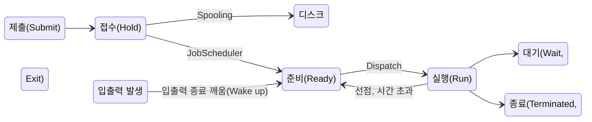

# Unix
1960년대 벨 연구소, GE, MIT가 공동 개발한 운영체제
- 시분할 시스템을 위해 설계
- 대부분 C언어로 작성되어 있어 이식성 높으며 프로세스간 호환성 높음
- 다중 사용자(Multi-User), 다중 작업(Multi-Tasking)을 지원
- 많은 네트워크 기능을 제공하므로 통신망(Network) 관리용 운영체제로 적합
- 트리 구조의 파일 시스템
- 전문적인 프로그램 개발에 용이
- 다양한 유틸 프로그램이 존재

## 커널(Kernel)
- UNIX의 핵심부분
- 컴퓨터가 부팅될 때 주기억장치에 적재된 후 상주하면서 실행
- 하드웨어를 보호하고 프로그램과 하드웨어 간의 인터페이스 역할을 담당함
- 프로세스관리, 기억장치 관리, 파일 관리, 입출력관리, 프로세스간 통신, 데이터 전송 및 변환 등 여러가지 기능 수행

## 쉘(Shell)
사용자의 명령어를 인식하여 프로그램을 호출하고 명령을 수행하는 명령어 해석기
- 시스템과 사용자간의 인터페이스 담당
- DOS의 COMMAND, COM과 같은 기능을 수행
- 파이프라인 기능을 지원
- 주기억 장치에 상주하지 않고 명령어가 포함된 파일 형태로 존재

## Utility Program
- 일반 사용자가 작성한 응용 프로그램을 처리하는데 사용
- DOS에서 외부 명령어에 해당

## 파일 디스크립터(File Descriptor)
파일을 관리하기 위한 시스템이 필요로 하는 파일에 대한 정보를 가진 제어 블록  
파일 제어 블록(File Control Block)이라고도 함  
- 파일마다 독립적으로 존재하며, 시스템상 다른 구조를 가질 수 있음
- 보조기억장치 내에 저장되어 있다가, 해당 파일이 Open될 때 주기억장치로 옮겨짐
- 파일 디스크립터는 파일 시스템이 관리하므로 사용자가 직접 참조할 수 없음.

# 배치 전략
새로 반입되는 프로그램이나 데이터를 주기억장치의 어디에 위치시킬 것인지를 결정하는 전략

- **최초 적합(First Fit)** : 프로그램이나 데이터가 들어갈 수 있는 크기의 빈 영역 중에서 첫번째 분할 영역에 배치시키는 방법
- **최적 적합(Best Fit)** : 프로그램이나 데이터가 들어갈 수 있는 크기의 빈 영역 중에서 단편화를 가장 작게 남기는 분할 영역에 배치시키는 방법
- **최악 적합(Worst Fit)** : 프로그램이나 데이터가 들어갈 수 있는 크기의 빈 영역 중에서 단편화를 가장 많이 남기는 분할 영역에 배치시키는 방법

# 페이지 교체 알고리즘
가상기억장치에 보관되어 있는 프로그램과 주기억장치의 영역을 동일한 크기로 나눈 후, 나눠진 프로그램(페이지)을 동일하게 나눠진 주기억장치의 영역(페이지 프레임)에 적재시켜 실행하는 기법

## OPT(OPTimal ReplaceMent, 최적 교체)
앞으로 가장 오랫동안 사용하지 않을 페이지를 교체하는 기법.  

## FIFO
각 페이지가 주기억장치에 적재될 때마다 그때의 시간을 기억시켜 가장 먼저 들어와서 오래있던 페이지를 교체하는 기법.  

## LRU(Least Recently Used)
최근에 가장 오랫동안 사용하지 않은 페이지를 교체하는 기법.
- 각 페이지마다 계수기(Counter)나 스택(Stack)을 두어 현 시점에서 가장 오랫동안 사용하지 않은, 가장 오래전에 사용된 페이지를 교체.  
- 페이지가 사용될 때마다 계수기 0으로 초기화, 이후 시간 증가

## LFU(Least Frequently Used)
사용 빈도가 가장 적은 페이지를 교체하는 기법

## NUR(Not Used Recently)
LRU와 비슷하게, 최근에 사용하지 않은 페이지를 교체하는 기법
- 사용되지 않은 페이지는 향후에도 사용되지 않을 가능성이 높은걸 전제로, LRU에서 나타나는 시간적인 오버헤드를 줄일 수 있음.
- 최근사용여부를 확인하기 위해 각 페이지마다 두개의 `하드웨어` 비트를 사용해 교체 페이지 순서를 결정

# 프로세스
프로세서(CPU)에 의해 처리되는 사용자 프로그램, 시스템 프로그램, 즉 실행중인 프로그램을 의미하며, 작업(Job), 태스크(Task)라고도 함.  

## PCB
운영체제가 프로세스에 대한 중요한 정보를 저장해 놓는 곳.  

- **프로세스의 현재 상태** : 준비, 대기, 실행 등의 프로세스 상태
- **포인터** : 부모, 자식 프로세스 주소, 프로세스가 위치한 메모리에 대한 포인터, 할당된 자원에 대한 포인터
- **프로세스 고유 식별자** : 프로세스를 구분할 수 있는 고유의 번호
- **스케줄링 및 프로세스의 우선순위** : 스케줄링 정보 및 프로세스가 실행될 우선순위
- **CPU 레지스터 정보** : 누산기, 인덱스, 범용 레지스터, 프로그램 카운터(PC)
- **주기억장치 관리 정보** : 기준 레지스터, 페이지 테이블 정보
- **입출력 상태 정보**
- **계정 정보**

## 프로세스 상태 전이


- 제출 : 작업을 처리하기 위해 사용자가 작업을 시스템에 제출한 상태
- 접수 : 제출돈 작업이 스풀 공간인 디스크의 할당 위치에 저장된 상태
- 준비 : 프로세스가 프로세서를 할당받기 위해 기다리고 있는 상태. 준비상태 큐에서 실행을 준비하고 있음.  
- 실행 : 준비상태 큐에 있는 프로세스가 프로세서를 할당받아 실행되는 상태. 프로세스 수행이 완료되기 전에 프로세스에게 주어진 할당시간이 종료되면 프로세스는 준비 상태로 전이됨.
- 대기 : 프로세스에 입출력 처리가 필요하면 현재 실행중인 프로세스가 중단되고 입출력 처리가 완료될 때까지 대기하고 있는 상태
- 종료 : 프로세스의 실행이 끝나고 프로세스 할당이 해제된 상태
  
- Dispatch : 준비 상태에서 대기하고 있는 프로세스 중 하나가 프로세서를 할당받아 실행상태로 전이되는 과정
- Spooling : 입출력장치의 공유 및 상대적으로 느린 입출력장치의 처리속도를 보완하고 다중프로그래밍 시스템의 성능향상을 위해 입출력할 데이터를 직접 보내지않고 나중에 한꺼번에 입출력하기 위해 디스크에 저장하는 과정

# 스레드
프로세스 내의 작업 단위로 시스템의 여러 자원을 할당받아 실행하는 하나의 프로그램 단위.  
- 스레드 기반 시스템에서 스레드는 독립적인 스케줄링의 최소 단위로서 프로세스의 역할을 담당.  
- 동일 프로세스 환경에서 서로 독립적인 다중수행이 가능

# HRN(Hightest Response-ratio Next)
실행시간이 긴 프로세스에 불리한 SJF(Shortest Job First) 기법을 보완하기 위한 것.  
- 우선순위 계산 공식을 이용하여 서비스(실행) 시간이 짧은 프로세스나 대기시간이 긴 프로세스에게 우선순위를 주어 CPU를 할당  
- 서비스 실행 시간이 짧거나 대기시간이 긴 프로세스일 경우 우선순위가 높아짐.  
- 우선순위를 계산하여 그 숫자가 가장 높은 것부터 낮은 순으로 우선순위 부여
```
우선순위 계산식 = (대기시간 + 서비스시간)/서비스 시간
```

# UNIX 명령어
- **uname** : 시스템의 이름과 버전, 네트워크 호스트명 등의 시스템 정보를 표시한다
- **fork** : 새로운 프로세스를 생성한다(하위 프로세스 호출, 프로세스 복제 명령)
- **mount** : 기존 파일 시스템에 새로운 파일 시스템을 서브 디렉터리에 연결할 때 사용

# IPv6
현재 사용중인 IPv4의 주소 부족 문제를 해결하기 위해 개발. 
- 긴 주소를 사용하고, 자료 전송 속도가 빠름.
- 인증성, 기밀성, 데이터 무결성의 지원으로 보안문제 해결
- 실시간 흐름 제어로 향상된 멀티미디어 기능을 지원
- Traffic Class, Flow Label을 이용하여 등급별, 서비스별로 패킷을 구분할 수 있어 품질 보장이 용이
- 기본 헤더 뒤에 확장 헤더를 더함으로써 다양한 정보의 저장이 가능해져 네트워크 기능 확장이 용이

## IPv6의 주소 체계
- 유니캐스트 : 단일 송신자와 단일 수신자 간의 통신
- 멀티캐스트 : 단일 송신자와 다중 수신자 간의 통신
- 애니캐스트 : 단일 송신자와 가장 가까이 있는 단일 수신자 간의 통신

# OSI 참조 모델

## 데이터 단위

1. 물리 계층 : 비트
2. 데이터 링크 계층 : 프레임
3. 네트워크 계층 : 패킷
4. 전송 계층 : 세그먼트
5. 세션 표현, 응용 계층 : 메시지

## 물리 계층
전송에 필요한 `두 장치간의 실제 접속`과 절단 등 기계적, 전기적, 기능적, 절차적 특성에 대한 규칙 정의
- 리피터, 허브

## 데이터 링크 계층
두개의 인접한 개방 시스템들 간에 신뢰성 있고 효율적인 정보전송을 할 수 있도록 `시스템 간 연결 설정과 유지 및 종료`를 담당. HDLC, LAPB, LLC, MAC, PPP 등의 표준이 존재  
- 랜카드, 브리지, 스위치

## 네트워크 계층
개방 시스템들 간의 `네트워크 연결`을 관리하는 기능. X.25, IP 등의 표준이 존재
- 라우터

## 전송 계층
논리적 안정과 `균일한 데이터 전송 서비스`를 제공함으로써 종단 시스템 간에 `투명한 데이터 전송`을 가능하게 함. TCP,UDP 등의 표준이 존재. 다중화, 오류제어, 흐름제어 설정
- 게이트웨이

## 세션 계층
송 수신 측 간의 관련성을 유지하고 `대화 제어`를 담당. 대화 구성 및 동기 제어, `데이터 교환 관리 기능`을 함.(`토큰` 사용)

## 표현 계층
응용 계층으로부터 받은 데이터를 세션 계층에 보내기 전에 통신에 적당한 형태로 변환하고, 세션 계층에서 받은 데이터는 응용 계층에 맞게 변환하는 기능을 함. 코드 변환, 데이터 암호화, 데이터 압축, 구문검색, 정보 형식 변환, 문맥 관리 등의 기능

## 응용 계층
사용자가 OSI 환경에 접근할 수 있도록 서비스를 제공
- HTTP

# TCP/IP
인터넷에 연결된 서로 다른 기종의 컴퓨터들이 데이터를 주고받을 수 있도록 하는 표준 프로토콜.  
- IP : 네트워크 계층, 비연결형 서비스 제공, 패킷의 분해/조립, 주소지정, 경로선택 기능을 제공. 헤더의 길이는 최소 20byte에서 최대 60byte

## 응용 계층 주요 프로토콜
- **HTTP** : 월드 와이드 웹에서 HTML문서를 송수신하기 위한 표준 프로토콜
- **DNS** : 도메인 네임을 IP주소로 매핑하는 시스템
- **FTP** : 컴퓨터와 컴퓨터 또는 컴퓨터와 인터넷 사이에서 파일을 주고받을 수 있도록 하는 원격 파일 전송 프로토콜
- **MQTT(Message Queing Telemetry Transport)** : 발행-구독 기반의 메시징 프로토콜

## 전송 계층 주요 프로토콜
- **TCP(Transmission Control Protocol)** : 양방향 연결, 스트림 위주의 전달(패킷 단위), 신뢰성 있는 경로 확립, 순서 제어, 오류 제어, 흐름 제어 기능을 함.
- **UDP(User Datagram Protocol)** : 비연결형 서비스, 단순한 헤더구조로 오버헤드가 적음, 순서제어 흐름제어가 없어 속도 빠름, 실시간 전송에 유리함.

## 인터넷 계층 주요 프로토콜
- **IP** : 전송할 데이터에 주소를 저장하고 경로를 설정하는 기능, 비연결형인 데이터그램 방식을 사용함
- **ICMP(Internet Control Message Protocol)** : IP와 조합하여 통신 중에 발생하는 오류의 처리와 전송 경로 변경 등을 위한 제어 메시지를 관리하는 역할, 헤더는 8byte로 구성
- **ARP(Address Resolution Protocol)** : 호스트의 IP주소를 호스트와 연결된 네트워크 접속 장치의 물리적 주소(MAC Address)로 변경(IP주소 -> MAC)
- **RARP(Reverse Address Resolution Protocol)** : ARP와 반대로 물리적 주소를 IP주소로 변환하는 기능(MAC-> IP주소)

## 네트워크 액세스 계층 주요 프로토콜
- **Ethernet(IEEE 802.3)** : CSMA/CD 방식의 LAN
- **IEEE 802** : LAN을 위한 표준 프로토콜
- **HDLC** : 비트 위주의 데이터 링크 제어 프로토콜
-   